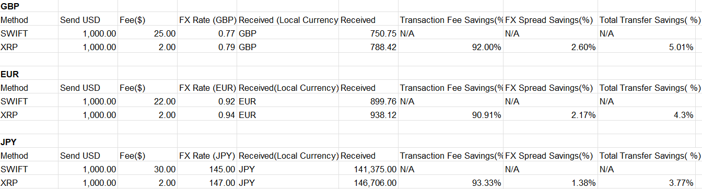

 Cross-Border Payment Cost Analysis
### Overview
I built this project to compare cross-border payment costs across multiple currencies, focusing on differences between traditional SWIFT transfers and an XRP-based model.
###  What’s Included
- 10 currency comparisons (GBP, EUR, JPY, AUD, INR, MXN, etc.)
- Transaction fee analysis
- FX rate comparison
- Total transfer savings (%)
- Final received amounts in local currency
###  Key Insight
Across all tested currencies, lower fees and improved FX rates resulted in consistent savings compared to traditional transfer systems.
###  Skills Demonstrated
- Financial modeling (Excel)
- FX rate analysis
- Cost comparison
- Cross-border payments understanding
- Microsoft Excel
###  Project Preview

